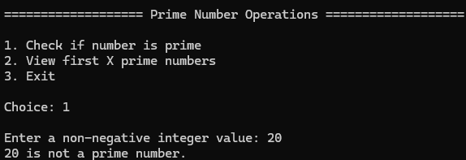
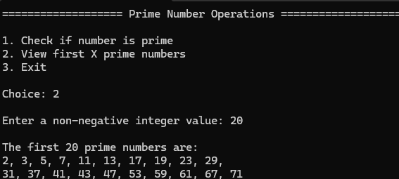

# 🔢 Prime Number (C#)


A C# console application that allows users to check whether a number is prime and generate the first X prime numbers using basic mathematical logic and object-oriented principles.

---

## Example Output




---

## 📌 Features

- 🧑 Accepts user menu input
- 🧮 Computes:
  - Whether a number is prime or not
  - The first X prime numbers
- 🖥️ Clean console-based user interaction
- 🧱 Demonstrates core C# fundamentals:
  - Classes and objects (OOP)
  - Methods and encapsulation

---

## 🧠 Algorithm Overview

This application follows an object-oriented, menu-driven approach to perform prime number operations. The program separates user interaction logic from prime number computations.

### 🔹 Program Flow

- The application starts by displaying a menu with three options:
  1. Check if a number is prime  
  2. Generate the first X prime numbers  
  3. Exit  

- The user inputs a menu choice.
- Input is validated using `TryParse` to ensure it is numeric.
- A `switch` statement routes execution based on the selected option.

---

### 🔹 Option 1: Check if a Number is Prime

- The user enters a non-negative integer.
- Input is validated to ensure it is numeric and ≥ 0.
- The program calls the `IsPrime()` method:
  - Numbers less than 2 are not prime.
  - 2 is treated as prime.
  - Even numbers greater than 2 are immediately rejected.
  - For odd numbers, the algorithm checks divisibility from 3 up to √n (incrementing by 2).
- If no divisors are found, the number is prime; otherwise, it is not.
- The result is displayed to the user.

---

### 🔹 Option 2: Generate First X Prime Numbers

- The user enters a non-negative integer representing how many primes to generate.
- Input is validated.
- The program calls the `GetPrimes()` method:
  - Initializes an empty list to store prime numbers.
  - Starts checking numbers from 2 upward.
  - Each number is tested using `IsPrime()`.
  - If a number is prime, it is added to the list.
  - The process continues until the list contains the requested number of primes.
- The resulting list is displayed:
  - Numbers are printed in sequence.
  - Commas separate values.
  - A line break is inserted after every 10 numbers for readability.

---

### 🔹 Exit Option

- Displays an exit message and terminates the program execution.

---

### 🔹 Design Notes

- The `PrimesTest` class handles user interaction and program flow.
- The `Primes` class encapsulates prime number logic.
- This separation of concerns improves maintainability and readability.
- The prime-checking algorithm is optimized by:
  - Eliminating even number checks early.
  - Limiting divisor checks to the square root of the number.
  - Skipping even divisors during iteration.

---

## ▶️ Getting Started

### Prerequisites

* .NET SDK installed
* Visual Studio or compatible IDE

### Run the App

```bash
dotnet build
dotnet run
```

Or in Visual Studio:

* Open the `.sln` file
* Press `F5` to run

---

## 💻 Example Run

```text
=================== Prime Number Operations ===================

1. Check if number is prime
2. View first X prime numbers
3. Exit

Choice: 1

Enter a non-negative integer value: 20
20 is not a prime number
```

---

```text
=================== Prime Number Operations ===================

1. Check if number is prime
2. View first X prime numbers
3. Exit

Choice: 2

Enter a non-negative integer value: 20

The first 20 prime numbers are:
2, 3, 5, 7, 11, 13, 17, 19, 23, 29,
31, 37, 41, 43, 47, 53, 59, 61, 67, 71
```

---

## ⚠️ Limitations

* Assumes valid numeric input
* Program closes for invalid option

---

## 📁 Project Structure

```text
PrimeNumberOperations/
│
├── PrimeNumberOperations.sln
├── PrimeNumberOperations/
│   ├── PrimesTest.cs
│   ├── Primes.cs
│   ├── PrimeNumberOperations.csproj
│   
├── Images/
│   └── prime-output.png
│   └── prime-list-output.png
```

---

## 🚀 Future Improvements

* [ ] Add input validation
* [ ] Loop for multiple calculations
* [ ] Convert to GUI (WinForms or WPF)

---

## 🔗 Repository

https://github.com/Austin-J-Phillips/PrimeNumber

---

## 📜 License

This project is open-source and available for educational use.

---

## 👤 Author

Austin Phillips
C# Developer (Learning & Building Projects)